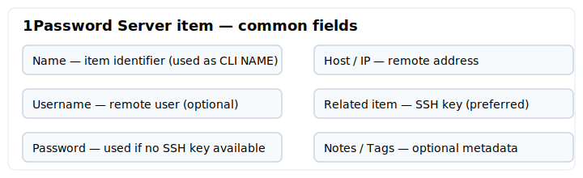
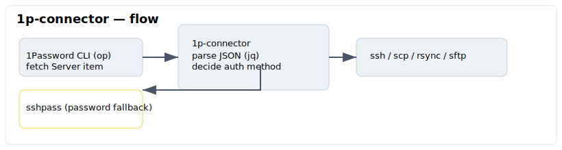
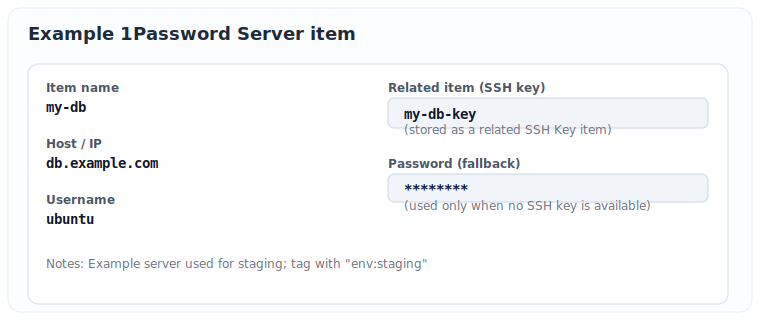

## 1p-connector

Lightweight bash script connector that uses 1Password Server items to drive SSH, SCP, RSYNC and SFTP sessions.

This tool fetches connection data (host, user, SSH key or password) from 1Password via the 1Password CLI and runs the requested remote command using the appropriate authentication method.

## Features
- Use 1Password Server items as connection profiles
- Automatically use a related SSH key (if present) or fall back to password-based auth
- Simple wrapper for ssh/scp/rsync/sftp commands
- Minimal dependencies and a small installer for quick setup
- Download **only** SSH public keys and store the SSH public key on disk, as a cache, for future use
- Fix [SSH server six-key limit](https://developer.1password.com/docs/ssh/agent/advanced#ssh-server-six-key-limit)
- Fix the SSH problem [Too many authentication failures error](https://developer.1password.com/docs/ssh/agent/advanced#match-key-with-host)

## Requirements
- A 1Password account and the relevant Server items saved in a vault
- 1Password CLI (`op`)
- `jq` (JSON processor)
- `sshpass` (only required when using password-based SSH)

Install these with your system package manager (apt/dnf/pacman/brew/etc.) or allow the installer to attempt automatic installation.

## Install

### All-in-one (download and run the installer):

```sh
wget -qO- https://raw.githubusercontent.com/augcampos/1p-connector/main/install.sh | sh -s --
```

### Manual install:

1. Download `1p-connector` from the releases or repository.
2. Make it executable:

```sh
chmod +x 1p-connector
```

3. Move it into a directory in your PATH, for example:

```sh
sudo mv 1p-connector /usr/local/bin/
```

## How to use

Create a [1Password Server item](https://support.1password.com/item-categories/#server) for each host you want to connect to. Use the following fields:

- Name: local identifier to use with the CLI (e.g. my-db)
- Username: remote user (optional — defaults to current user)
- Host / IP: remote host
- Related item: associate an SSH key item if you use key-based auth
- Password: used when no SSH key is available

You can target a specific category by setting `OP_CATEGORY` (defaults to `Server`).

Examples (replace NAME with your 1Password Server item name):

```sh
# SSH into the host
1p-connector ssh NAME

# Run a remote command
1p-connector ssh NAME -- ls -la /var/www

# Copy from remote to local
1p-connector scp NAME:/remote/path ./local/path

# Sync remote directory via rsync
1p-connector rsync NAME:/remote/dir ./local/dir
```

Behavior notes:
- If a related SSH key exists, it will be used as the SSH identity file. The public key is written to a secure temporary file (0600) and deleted on exit.
- If no key is present, the script will attempt password auth (requires `sshpass`).
- For `scp` and `rsync`, arguments that start with `NAME:` are rewritten to `user@host:` automatically.
- Port is respected for `ssh` (`-p`), `sftp`/`scp` (`-P`), and via `-e "ssh -p ..."` for `rsync`.

Show help:

```sh
1p-connector --help
```

## Diagrams

Visual reference for 1Password Server item fields and the connector flow:





Example Server item (how a real item might look in 1Password):



## Troubleshooting & Security
- The installer may attempt to install `op`, `jq`, and `sshpass` using your package manager; if automatic install fails, install them manually.
- Piping remote scripts directly to `sh` executes code from the internet — inspect the script before running if you require assurance.
- Ensure `op` is authenticated (signed in) before running commands that need secrets from 1Password.
- The temporary private key file is removed on exit. On systems without `shred`, a simple `rm` is used.

## Uninstall

Remove the installed binary (adjust path if you used a different install location):

```sh
sudo rm -f /usr/local/bin/1p-connector
```

## Contributing

Issues and PRs are welcome. Please open small, focused PRs and include tests when applicable.

## License
See the `LICENSE` file in this repository.
